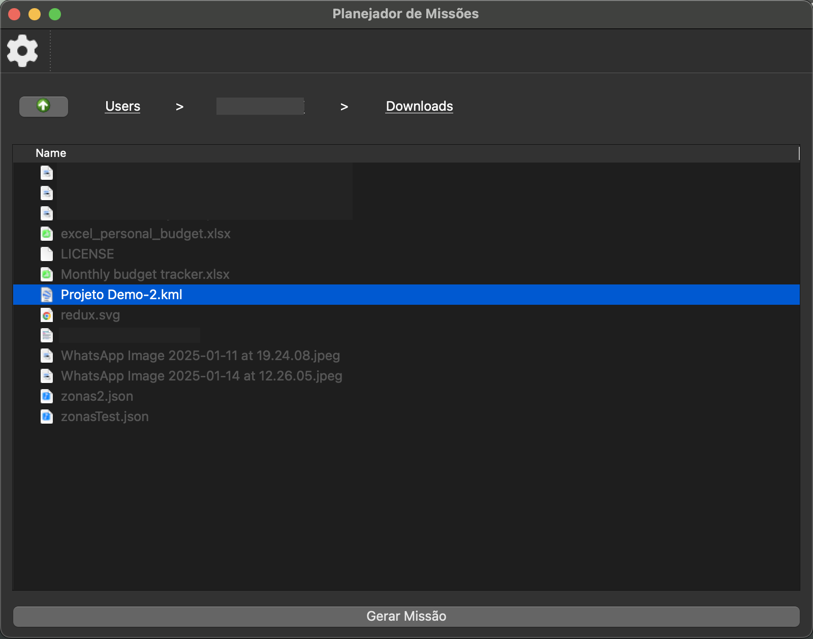

# KML Mission Planner 

[](https://www.python.org/downloads/)
[](https://opensource.org/licenses/MIT)

A professional GIS mission planning solution for drone operations using KML geographic data specifications.



## Key Features

### Core Capabilities
- 🗺️ KML File Processing with Advanced Parsing
- ✈️ MOSA (Mission Optimization & Safety Algorithms) Integration
- ☁️ Cloud-Native Architecture with REST API Backend
- 📦 Mission Package Generation (PLAN/KML/JSON)

### Technical Highlights
- Qt5-based Modern GUI Framework
- Persistent Configuration Management (QSettings)
- Async Server Communication
- ZIP64 Archive Support
- Cross-Platform Compatibility

## Installation

### Prerequisites
- Python 3.10 or newer
- Git (for development installs)

### Standard Installation
```bash
# Install from PyPI (coming soon)
# pip install kml-mission-planner

# Install directly from repository
pip install git+https://github.com/vpmattei/patron_mission_generator_app.git
```

### Developer Installation
```bash
git clone https://github.com/vpmattei/patron_mission_generator_app.git
cd kml-mission-planner
pip install -e .
```

### Running the Application

Once you have installed the required libraries, you can run the application using the following command:

```bash
python3 mission_planner.py
```

## Usage

### Basic Workflow
1. Launch application: `mission-planner`
2. Navigate to KML file using integrated explorer
3. Configure MOSA parameters via Settings (⚙️ icon)
4. Generate mission package (Right-click → Generate Mission)
5. Save ZIP package with mission artifacts

### Advanced Features
- **Breadcrumb Navigation**: Path visualization with clickable history
- **Smart Filtering**: KML-only file visibility
- **Contextual Help**: Hover tooltips for all parameters
- **Server Sync**: Automatic MOSA configuration updates

## Configuration

### Environment Variables
```ini
export MISSION_API_ENDPOINT="https://patronrouteplanner.zapto.org/api/v2"
export MOSA_CACHE_TTL="3600"  # 1 hour cache
```

### Persistent Settings
User preferences stored in:
- Linux: `~/.config/GrapeHawk/Planejador de Missões.conf`
- Windows: `%APPDATA%\GrapeHawk\Planejador de Missões.conf`

## Development

### Architecture Overview
```
src/
├── kml_parser/       # KML processing core
├── mission_planner/  # Main application logic
├── mosa_settings/    # Configuration UI
└── assets/           # Graphical resources
```

### Build System
```bash
# Create standalone executable
pyinstaller --onefile --windowed --icon assets/icons/app.ico mission_planner.py

# Run test suite
python -m pytest tests/
```

## Support & Documentation

For full technical documentation see our [Wiki](https://github.com/yourorg/kml-mission-planner/wiki).

| Component          | Documentation Link                     |
|---------------------|----------------------------------------|
| KML Specifications  | [KML Reference](https://developers.google.com/kml/documentation) |
| Mission API         | [API Docs](https://patronrouteplanner.zapto.org/api-docs) |
| Qt Framework        | [PyQt5 Documentation](https://www.riverbankcomputing.com/static/Docs/PyQt5/) |

## License

MIT Licensed - See [LICENSE](LICENSE) for full text.

© 2024 Vinícius Mattei. All Rights Reserved.