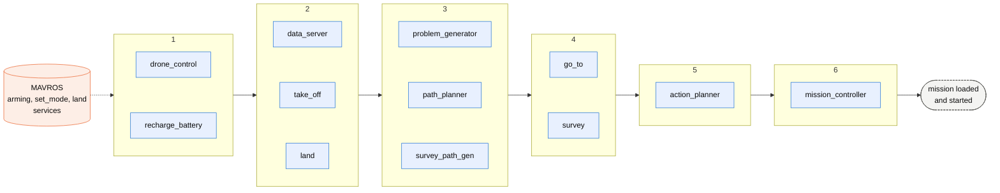

# Node initialization sequence

`harpia_launch.py` starts every process at once. The order in which the
`drone_planner` nodes actually come up is decided at runtime by
`lifecycle_manager.py`: each managed node is a ROS 2 lifecycle node, and the
manager only configures and activates a node once every node it depends on is
already `active`. The chart reads left to right: each numbered step lists
the nodes that come up together once the previous step is fully active.

Each numbered step waits for every node of the previous step to be `active`
before its own nodes are configured and activated. Nodes inside the same step
come up concurrently. MAVROS must be running before step 1 completes, because
`drone_control` waits for its services during activation. `lifecycle_manager`,
`command_interface` and `route_executor` are plain nodes that start
immediately with the launch file and are not part of the sequence.

Why each step depends on the previous one, from the `depends_on` table in
`lifecycle_manager.py`:

| Step | Nodes | Wait for |
|---|---|---|
| 1 | drone_control, recharge_battery | nothing |
| 2 | data_server, take_off, land | drone_control |
| 3 | problem_generator, path_planner, survey_path_gen | data_server |
| 4 | go_to, survey | path_planner, survey_path_gen (and the `/drone/move_to_waypoint` action server of route_executor) |
| 5 | action_planner | go_to, survey, recharge_battery, take_off, land |
| 6 | mission_controller | action_planner, problem_generator |

## How the manager decides

- **Discovery.** For every entry in its `nodes` table the manager polls the
  node's `get_state` service every 0.2 s. A node that does not answer within
  100 tries (about 20 s) is logged as not found and dropped from the table.
  Any node that lists it as a dependency then makes the manager raise a
  `KeyError` on its next tick, so startup aborts rather than stalls.
- **Start.** Once every managed node has reported a state, the manager starts a
  0.5 s timer. On each tick it walks the table and, for every node whose
  dependencies are all `active`, sends `configure` if the node is
  `unconfigured` or `activate` if it is `inactive`. Only one transition is in
  flight per node at a time.
- **Steps.** Because a node needs two ticks (configure, then activate) plus its
  own `on_configure` and `on_activate` work, each step adds at least a second
  before the next one can start. Nodes in the same step transition
  concurrently.
- **Done.** When every managed node is `active` the manager logs
  "Finished activating all lifecycle nodes" and stops its timer.

## What blocks a hung startup

- **MAVROS.** `drone_control` is in step 1 and every later step hangs off it.
  Its `on_activate` waits up to 10 s for `/mavros/cmd/arming`,
  `/mavros/set_mode` and `/mavros/cmd/land` and returns `ERROR` if any is
  missing. If MAVROS is not up, nothing beyond step 1 is even configured.
- **route_executor.** `go_to` and `survey` block in `on_activate` until the
  `/drone/move_to_waypoint` action server exists. That server is
  `route_executor`, a plain node started by the launch file, so it is normally
  already there; if it crashed, step 4 never completes.
- **data_server services.** `path_planner` blocks in `on_configure` until
  `data_server/home_position` and `data_server/drone_position` are available,
  `survey_path_gen` until `data_server/home_position` is, and
  `mission_controller` fails activation if `problem_generator/get_problem` or
  `plansys_interface/update_parameters` (served by `action_planner`) is not up
  within 5 s. The dependency table already orders these correctly, so they
  only matter if an earlier node activated without actually creating its
  services.

## Nodes outside the manager

- `lifecycle_manager` itself, `command_interface` and `route_executor` are
  plain `rclpy` nodes. They start as soon as the launch file runs them and are
  not gated on anything, although `route_executor` only requests control of
  the drone from `drone_control` when its first goal arrives.
- `command_interface` forwards commands from the CLI to `mission_controller`
  and `action_planner`, so it is only useful once step 6 is done.

## After activation

When `mission_controller` activates it checks whether the drone_planner CLI is
present (`drone_planner_cli/presence`). It then asks `problem_generator` for
the PDDL problem. Without the CLI it starts the mission right away; with the
CLI it loads the problem and waits for a start command.
